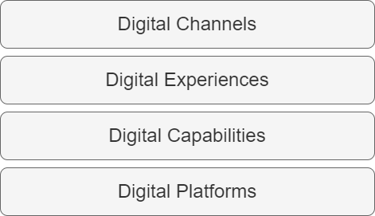

== Structures

An organization's ability to communicate it's business capabilities both internally and externally is fundamental to investment, strategic alignment, partnerships, and value delivery. This is often one of the first opportunities to address in the practice of ((Corporate Strategy)) and ((Enterprise Architecture)) to enable effective collaboration with a ubiquitous business language. For a few examples, see https://www.leanix.net/en/wiki/ea/business-capability[LeanIx], https://www.lucidchart.com/blog/a-quick-guide-to-business-capability-maps[LucidChart], https://www.capstera.com/how-to-build-a-business-capability-map/[Capstera], and https://www.bmc.com/blogs/business-capability-mapping/[BMC].

(((Models)))
The value of a ((Business Capability Model)) really begins to shine when a ((Business Capability Map)) is created to map capabilities to organizational concerns like customers, products and services, business strategy, initiatives and programs, organizational structures, technology architectures, etc. Each of these can be explored with a ((gap analysis)) of current vs. one or more alternatives.

[quote, George E. P. Box]
All models are wrong, but some are useful.

Business Capability Models are often defined as a hierarchy with increasing granularity from top tiers down to the actual individual capabilities and functions created and supported by value delivery teams. Models are often ideal, abstract or even theoretical, making it difficult to cleanly map each capability to the reality of complex organizational concerns. For example, multiple technology systems may all contribute to a unique aspect of a single capability or even provide redundant capabilities. Similarly, delivery teams and organization structures may have "((shared ownership))" of one or more capabilities, creating unwanted friction because of value delivery dependencies.

=== Classifying and visualizing capabilities

It can be helpful to consider how customers or end-users interact with digital value. What channels expose the value to them? How do they experience value? What capabilities deliver value? And, what platforms enable those capabilities to be built and maintained?

.Value delivery structures

==== Digital Channels

Like https://en.wikipedia.org/wiki/Marketing_channel[marketing channels], what digital channels expose one or more digital experiences to a user?

.Some Examples
====
* Web
* Native Personal Devices, like Mobile
* E-mail
* Voice
* Chat
* "Internet of Things" (IoT) devices (e.g. robots, home devices, etc.)
====

==== Digital Experiences

How does a person interface and interact with the digital product or service? "Journeys" can be a synonym for experiences.

.Some Examples
====
* Customer Digital Experiences like Digital Commerce "Buy" and "Sell"
* Associate / Employee Digital Experiences like onboarding, way finding, sales, customer support, etc.
* Developer Digital Experiences like infrastructure provisioning, DevOps pipelines and toolchains, operations, support, etc.
====

==== Digital Capabilities

What digital capabilities enable an end-to-end digital experience?

.Some Examples
====
* "Accepting payment" for digital commerce customers
* Product catalog listings for digital retail
* Digital knowledge management search for associates
* Managed DevOps pipelines for developers
====

==== Digital Platforms

What digital platforms support building, delivering, and operating digital capabilities?

.Some Examples
====
* Cloud platforms
* Digital Commerce
* Customer Relationship Management (CRM)
* Enterprise Resource Planning (ERP)
* Collaboration and Knowledge Management
* DevOps toolchains
====

=== Organizational structure

We briefly touched on the pitfalls of focusing too much on People when designing organizational structures with Conway's Law. The realities and influence of https://hbr.org/2017/04/the-4-types-of-organizational-politics[organizational "politics"] cannot be ignored. We also highlighted that https://teamtopologies.com/[Team Topologies] is an excellent resource for structuring team and team interactions. However, we must emphasize the importance of understanding both current and desired Business Capabilities along with the Technology strategy to inform successful organizational structure decisions. It may seem obvious, but the evolution of Process toward agility and continuous improvement suggests that an organizational structure must also change, but carefully consider the frequency and impacts of change.

=== Conclusions

These four structures aid in communicating and evolving an organization's capabilities to inform organizational structure and to provide a common language that clarifies, unites and aligns strategy. Understanding the four lifecycle stages of value delivery will add an element of time to an organization's strategy.
